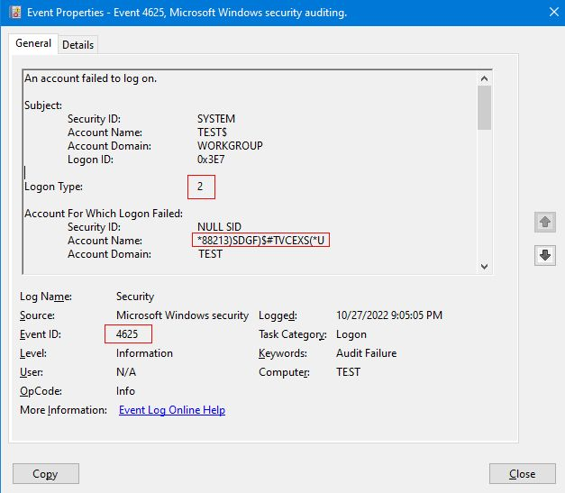

# Uncover Username Password Credentials in Windows

## Premise 

If you accidentally type your ***password*** into the ***username*** field in 
**Windows**, CHANGE YOUR PASSWORD!  Especially at work.  ***Usernames for failed 
logons*** are stored in **event logs**, and often forwarded to a corporate 
**logging** or **SIEM** tool that many people could *easily query!*

## Exploit

Search event logs for Windows **event ID 4625** (logon failure) and **Logon 
type 2** (interactive logon). The account name field might show users' 
password or username concatenated with password.

[Reference](https://www.linkedin.com/feed/update/urn:li:activity:6991615839225466880/)
